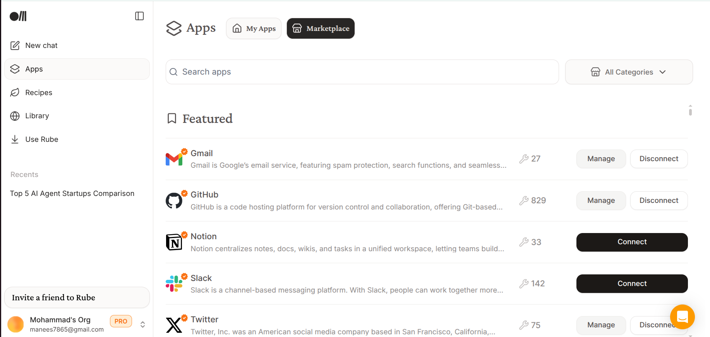
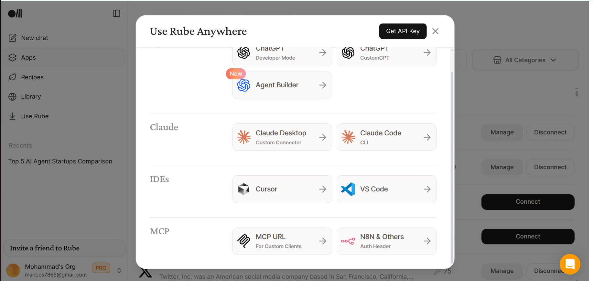

Below is a clean, student-friendly **README** that explains Rube, what it offers, and how to integrate it with both **Gemini CLI** and **Claude Code**.
It also includes a simple walkthrough on how to add apps inside Rube.

You can copy-paste this directly into GitHub/Notion.

---

# 🚀 Rube + MCP + AI Dev Tools — Student Guide

### *Connect hundreds of apps to Gemini CLI and Claude Code using the Model Context Protocol (MCP)*

---

## 📌 1. What Is Rube?

**Rube** is a powerful **MCP (Model Context Protocol) server** that connects AI models to real apps and tools.

Think of it as a **super-connector**:

```
Gemini CLI → Rube → GitHub, Firebase, Notion, Gmail, Drive, Figma, Chrome…
Claude Code → Rube → (same apps)
```

### 🧠 In simple words:

> Rube lets your AI agent control your apps — safely, securely, and with your permission.

---

## 🎁 2. What Do You Get With Rube?

Rube gives you **500+ integrations** that you can use from your AI tools.

### ✔ You can automate:

* GitHub Issues, PRs, commits
* Firebase deploy, hosting, database
* Stripe payments
* Notion pages
* Gmail sending/reading
* Google Drive file actions
* Figma project actions
* Chrome automations
* Database operations (Postgres, Mongo, Upstash)
* And **hundreds more**

### ✔ Rube also provides:

* **Multi-app actions**
* **Secure OAuth**
* **Unified Dashboard**
* **Usage logs**
* **Task history**
* **Free credits in beta**

This allows AI tools to behave like a smart assistant that can:

* write code
* commit to GitHub
* deploy to Firebase
* create a Notion doc
* send emails
* organize files

All through Rube’s MCP layer.

---

## 🔌 3. Connecting Rube to Gemini CLI

Gemini CLI supports **HTTP-based MCP servers**.

Just open your Gemini settings file:

Linux/Mac:

```
~/.gemini/settings.json
```

Add this entry:

```json
"mcpServers": {
  "rube": {
    "httpUrl": "https://rube.app/mcp"
  }
}
```

Save and restart Gemini CLI.

### ✔ To test Rube tools:

Inside Gemini CLI:

```
/mcp list
```

You should now see hundreds of Rube tools available.

---

## 🤖 4. Connecting Rube to Claude Code / Claude Desktop

Claude Code uses a local `.claude/*` MCP configuration folder.

### Step-by-Step Setup:

1.  **Run the setup command in your terminal:**
    ```bash
    claude mcp add --transport http rube -s user "https://rube.app/mcp"
    ```

2.  **Open Claude Code and run the MCP command:**
    ```
    /mcp
    ```

3.  **Select Rube:**
    Choose **Rube** from the list and press Enter.

4.  **Authenticate:**
    Select the **Authenticate** option to start the login process.

5.  **Complete Login:**
    A browser window will open. Complete the authentication there.

6.  **Ready to Go:**
    Return to Claude Code. You are now ready to use 500+ apps with Rube!

### After installation:

1. Restart Claude Desktop
2. Open **Tools** panel
3. You will see **Rube** listed with all available tools

You can now ask Claude:

> “List my GitHub repos using Rube.”
> “Deploy my Firebase project using Rube.”
> “Create a Notion page for me with this content.”

---

## 🧩 5. How to Add Apps Inside Rube

Rube has a clean dashboard where you can connect apps.

### Steps:

1. Go to **[https://rube.app](https://rube.app)**
2. Log in with GitHub or Google
3. Go to **Connected Apps** or **Apps**
4. Search for the app you want (e.g., Notion, GitHub, Gmail, Stripe)
5. Click **Connect**
6. Complete the OAuth permission popup

**Visual Guide:**



### After adding your apps:

* Rube automatically exposes their tools to Gemini CLI
* Rube exposes them to Claude Code
* You don’t need any keys or manual setup

### ✔ Example:

Connect GitHub → Claude can now:

* create repos
* push commits
* open issues
* merge PRs

Connect Firebase → Gemini CLI can now:

* deploy hosting
* manage Firestore
* run auth scripts

---

## ℹ️ Need More Help?

For additional help with connecting Rube to other clients, or for more detailed instructions regarding Claude CLI, please check the official guide.

**Visit:** `rube.app/use-rube`



---

## ⭐ 6. Why Developers Should Use Rube + MCP

MCP is quickly becoming the **standard protocol** for AI tools.

Rube is the “toolbox” that plugs into it.

### Students get:

| Benefit                       | Explanation                                |
| ----------------------------- | ------------------------------------------ |
| One connection → many apps    | No need to install 100 extensions          |
| AI automation                 | Your model can “do things,” not just reply |
| Secure OAuth                  | No API keys needed                         |
| Same tools in Gemini & Claude | Write once, use everywhere                 |
| Super fast prototyping        | Build automation without backend code      |

---

## 🏁 7. Recommended For Students

Use Rube if you want to build:

* AI agents
* Automation workflows
* Developer tools
* Personal assistants
* AI + App integrations
* Research or productivity helpers

Rube + MCP + Gemini CLI + Claude Code is a **killer toolkit** for modern AI development.

---

## 🎉 8. Summary for Students

| Tool            | Purpose                             |
| --------------- | ----------------------------------- |
| **Rube**        | Main MCP server with 500+ apps      |
| **Gemini CLI**  | Shell AI with tool automation       |
| **Claude Code** | AI coding partner with tool actions |
| **MCP**         | Protocol that lets AIs use tools    |